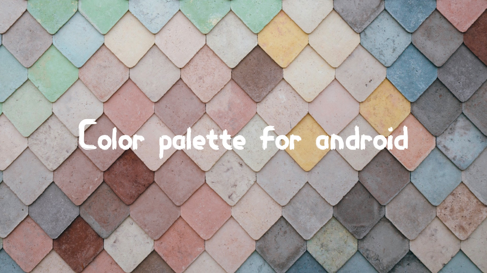

## Download App

## Color-palette-android
Find your color codes

<strong>This app contain</strong>

<ol style="list-style-type: lower-roman;">
<li><strong>Material colors&nbsp;</strong></li>
<li><strong>Gradient colors&nbsp;</strong></li>
<li><strong>Flat ui colors&nbsp;</strong></li>
<li><strong>Social colors&nbsp;</strong></li>
<li><strong>Metro colors&nbsp;</strong></li>
<li><strong>Fluent colros&nbsp;</strong></li>
<li><strong>Create new color&nbsp;</strong></li>
<li><strong>Save your favorite colors</strong></li>
</ol>

<strong>Screen shots :&nbsp;</strong>

<table style="width: 519px;">
<tbody>
<tr>
<td style="width: 251px;"></td>
<td style="width: 252px;">

</td>
</tr>
<tr>
<td style="width: 251px;"></td>
<td style="width: 251px;"><strong></strong></td>
</tr>
</tbody>
</table>

## License
This project is licensed under the terms of the MIT license.
